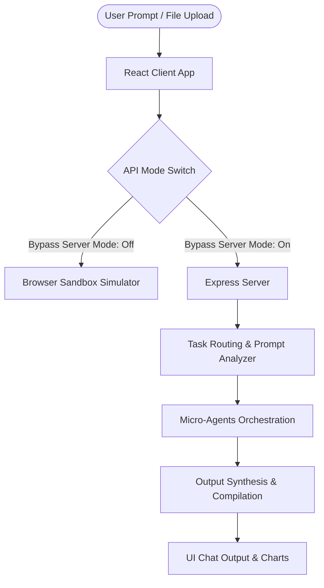

<<<<<<< HEAD
# AI Workspace Copilot

A modern, production-quality, multi-agent AI productivity workspace built with **React, TypeScript, Tailwind CSS, Framer Motion, and Express**. The application replicates a high-end SaaS product (similar to Cursor, Notion AI, and Linear) and helps users run parallel research, content generation, and workbook plotting tasks.

---

## 🧭 Architecture & Flow Diagrams

The workspace implements a structured multi-agent routing workflow. Detailed components, execution sequences, and data-flow diagrams are fully described here:

🔗 **[System Architecture & Workflow Flowcharts](docs/architecture.md)**



---

## 🛠️ Getting Started

The project features a **root-level orchestrator configuration**, making it easy to run both applications:

### 1. Installation

Install all required node packages for the entire project:
```bash
npm run install:all
```

### 2. Execution

- **Start Frontend (Client Dev Server):**
  ```bash
  npm run dev
  ```
  The React frontend will start locally (usually on [http://localhost:5173](http://localhost:5173)).
  
- **Start Backend (Express Server):**
  ```bash
  npm run backend
  ```
  The Express server will start on [http://localhost:5000](http://localhost:5000).

---

## 🤖 GitHub CI/CD Actions

We have included a continuous integration suite located at [.github/workflows/ci.yml](.github/workflows/ci.yml). It automates the checkout, dependency installation, and production build checks for the backend and frontend client on every push/PR to main branches.
=======
# Copilot-Workspace-
>>>>>>> 69adb4f388380dddf3a2b3ce1d81ec5fdcfb40ec
