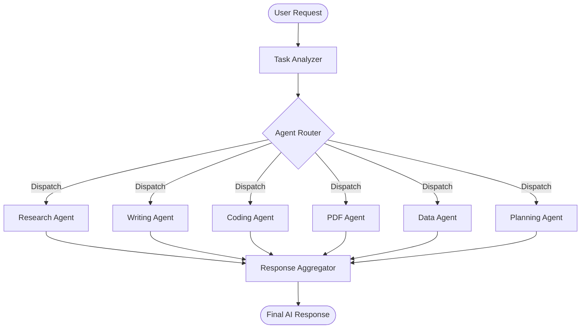
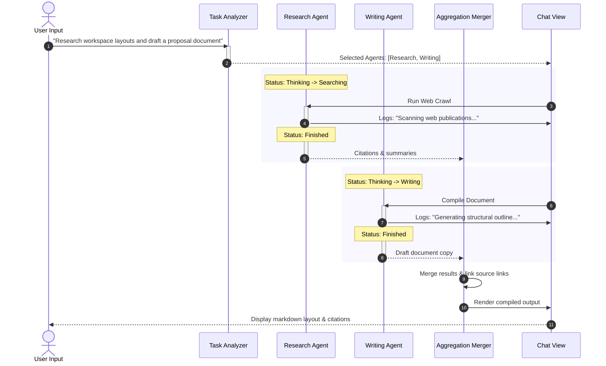
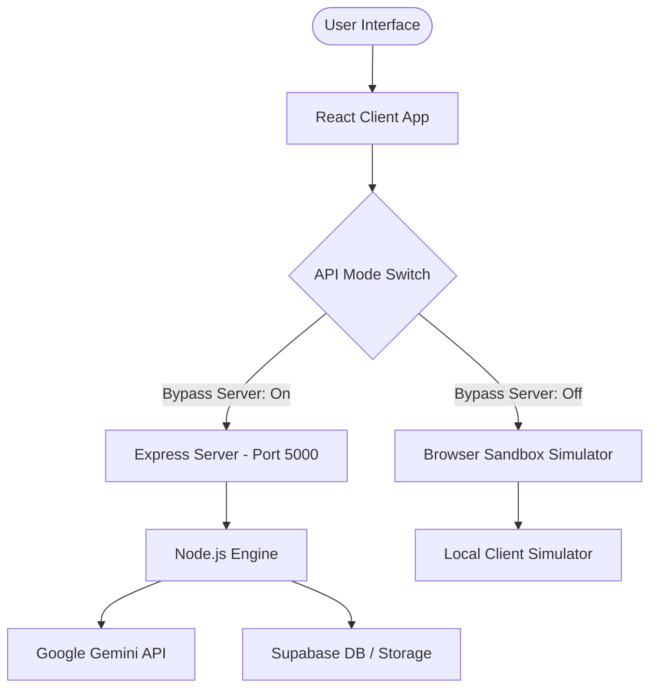

# 🚀 AI Workspace Copilot

> **A modern multi-agent AI productivity workspace that helps users research, write, analyze, plan, and code using specialized AI agents.**

AI Workspace Copilot is a production-inspired AI platform that combines multiple specialized AI agents into a single, intuitive workspace. Instead of acting as a simple chatbot, it intelligently routes user requests to the most appropriate agents, enabling users to complete complex tasks faster and more efficiently.

---

## ✨ Features

* 🔍 **AI Research Agent**
  * Research topics and find latest news
  * Summarize search results
  * Compare sources and generate citations

* ✍️ **Writing Agent**
  * Draft emails and LinkedIn posts
  * Generate reports and documentation
  * Compose blog posts and meeting notes

* 💻 **Coding Agent**
  * Generate React & TypeScript code snippets
  * Explain complex algorithms and syntax
  * Refactor code and review files for improvements

* 📄 **PDF Assistant**
  * Upload PDF documents
  * Extract text layers and generate summaries
  * Search tables and index core methodologies

* 📊 **Data Analysis Agent**
  * Parse CSV workbooks dynamically
  * Render responsive line, bar, and area charts (powered by Recharts)
  * Detect anomalies and project trends

* 📅 **Planning Agent**
  * Compile multi-phase study plans
  * Generate project roadmaps
  * Build sprint timelines and Gantt charts

---

# 🧠 Multi-Agent Workflow

The system routes user prompts through a task routing analyzer. Selected agents coordinate sequential execution blocks, emitting telemetry logs to the user before merging results.

### 📋 Request & Routing Flowchart



### ⏱️ Sequential Execution Sequence



---

# 🏗️ System Architecture

The application is structured as a decoupled client-server setup with a built-in sandbox bypass toggle in Settings, ensuring it can run offline out-of-the-box.



---

# 🖥️ Tech Stack

### Frontend
* **Core:** React, TypeScript
* **Styling:** Tailwind CSS (v4)
* **Animations:** Framer Motion
* **Icons:** Lucide Icons
* **Charts:** Recharts

### Backend
* **Server:** Node.js, Express
* **Parsing:** csv-parser, multer

### AI & Infrastructure
* **AI Model:** Google Gemini
* **Database & Storage:** Supabase PostgreSQL & Supabase Storage

---

# 🤖 GitHub Actions Workflow

We have configured a Continuous Integration workflow at [`.github/workflows/ci.yml`](.github/workflows/ci.yml). 

It automatically runs on every push and pull request to `main`/`master` branches:
- Spins up a Linux environment.
- Configures Node.js (v18).
- Installs backend and frontend dependencies.
- Runs frontend production compile check (`tsc -b && vite build`) to verify zero compiler errors.

---

# 📂 Project Structure

```
.github/
  workflows/
    ci.yml           # GitHub Actions CI pipeline
backend/
  server.js          # Express API and multi-agent orchestrator logic
  package.json       # Backend package settings
docs/
  architecture.md    # System architecture and workflow details
frontend/
  src/
    assets/          # Media resources
    index.css        # Tailwind v4 directives and theme variables
    types.ts         # TypeScript models
    App.tsx          # Main dashboard, chat layouts, and views
    main.tsx         # Mounting wrapper
  tailwind.config.js # Styling configurations
  postcss.config.js  # PostCSS Tailwind plugins mapping
  package.json       # Frontend package settings
README.md            # Documentation homepage
package.json         # Root scripts launcher
```

---

# 🚀 Getting Started

## Clone the repository

```bash
git clone https://github.com/bhavaghnyabollepalli/Copilot-Workspace-.git
cd Copilot-Workspace-
```

## Install dependencies

Install both client and server packages in one command:
```bash
npm run install:all
```

## Start the frontend

```bash
npm run dev
```

## Start the backend

```bash
npm run backend
```

---

# 🎯 Key Highlights

* **Modern SaaS-inspired interface:** Minimal borders, card shadows, and smooth dark-theme transitions.
* **Confetti Feedbacks:** Integrated canvas confetti triggers when checklists are completed.
* **Voice-enabled interactions:** Simulated microphone duration recording and speech insertion.
* **Standalone Sandbox Mode:** Active fallback simulation so all agent logs, chart plotting, and code blocks can be fully tested without API keys configured.

---

# 🔮 Future Enhancements

* Real-time collaboration
* Memory-enabled AI agents
* Calendar integration
* GitHub integration
* Cloud deployment
* Workflow automation
* Presentation generation
* Advanced analytics

---

# 📄 License

This project is intended for educational, portfolio, and hackathon purposes.
