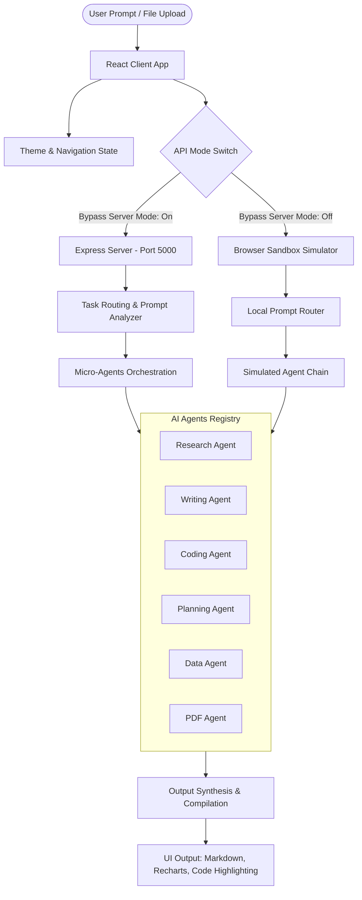
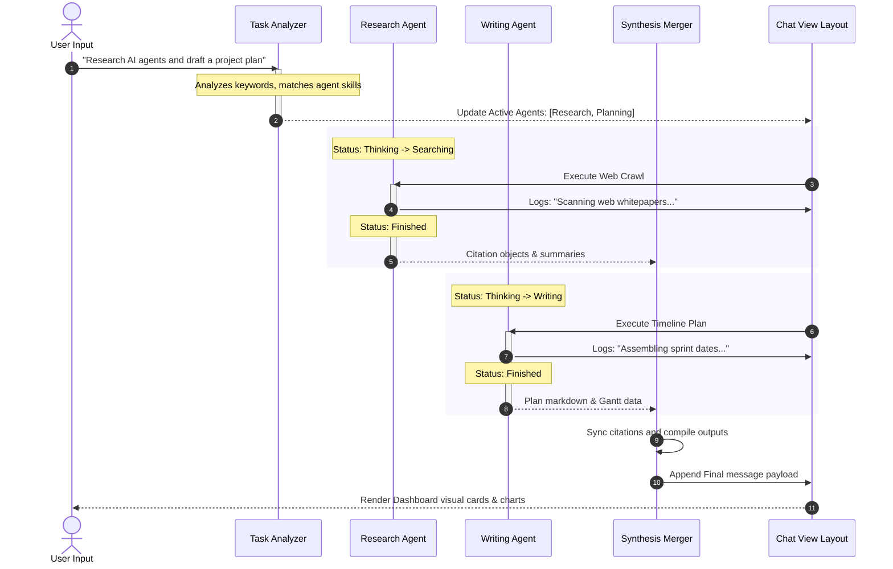
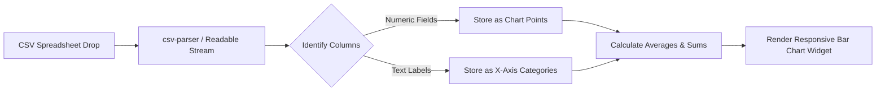

# System Architecture & Workflow Flowcharts

This document describes the high-level architecture, multi-agent coordination system, and data analysis pipelines of the AI Workspace Copilot.

---

## 🏗️ High-Level System Architecture

The workspace utilizes a decoupled client-server architecture with an intelligent orchestration layer on the backend and a local fallback sandbox inside the React client.

---

## 🧭 Multi-Agent Task Routing Workflow

When a query is dispatched, it runs through the Task Analyzer to map which sub-agents have matching capabilities. The selected agents execute sequentially or parallelly, updating active status indicators.

---

## 📊 CSV & Data Visualization Pipeline

When a user drops a spreadsheet or text workbook, the Data Agent parses columns, detects numeric columns, and forwards plotted datasets to Recharts.

